<a href="https://github.com/diansour-king">&nbsp;<samp>github</samp></a> &nbsp;&nbsp;·&nbsp;&nbsp;
<a href="mailto:bikashkumarshah43@gmail.com">&nbsp;<samp>email</samp></a>

<!-- Add these back once you give me the URLs, in the same style as the lines above:
<a href="https://www.linkedin.com/in/YOUR-HANDLE">&nbsp;<samp>linkedin</samp></a> &nbsp;&nbsp;·&nbsp;&nbsp;
<a href="https://leetcode.com/u/YOUR-HANDLE/">&nbsp;<samp>leetcode</samp></a>
-->

> B.Tech CSE at National Institute of Technology (NIT) Rourkela (Batch of 2027). 
> From Biratnagar, Nepal. 
> Ship the small honest version first, then make it hold up under load.

I build full-stack AI products and the unglamorous machinery underneath them — 
document parsing pipelines, background queues, vector search, and the evaluation 
harnesses that tell you whether any of it actually works. Currently deep in 
retrieval quality, prompt-injection defence, and computer vision.

<samp>python &nbsp; typescript &nbsp; java &nbsp; c++ &nbsp; sql &nbsp; pytorch &nbsp; opencv &nbsp; scikit-learn &nbsp; fastapi &nbsp; next.js &nbsp; react &nbsp; node &nbsp; tailwind &nbsp; postgresql &nbsp; pgvector &nbsp; redis &nbsp; mongodb &nbsp; docker &nbsp; git &nbsp; linux</samp>

**[careerlayer](https://github.com/diansour-king)** &nbsp;·&nbsp; <samp>next.js, fastapi, postgresql, pgvector, redis, docker</samp> 
Resume analysis and job-matching platform built around an integrity layer. 
Six detectors catch resumes engineered to fool an LLM screener — invisible text, 
injected instructions, layer tricks — with 51 tests over the detection package alone. 
Every claim the analyser makes is grounded in a page region and drawn back onto the 
document as a bounding box, so a reviewer can check the source rather than trust a score.

**[ir-quality-classifier](https://github.com/diansour-king)** &nbsp;·&nbsp; <samp>python, pytorch, opencv</samp> 
Infrared image quality classification, extended from single frames to video 
without disturbing the original image pipeline. Frame-level scoring aggregated 
into a stream-level verdict.

**[resq-ai](https://github.com/diansour-king)** &nbsp;·&nbsp; <samp>python, computer vision</samp> 
Emergency-response assistance built on vision models.

